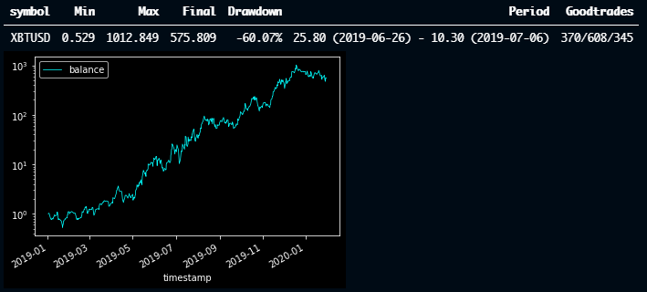
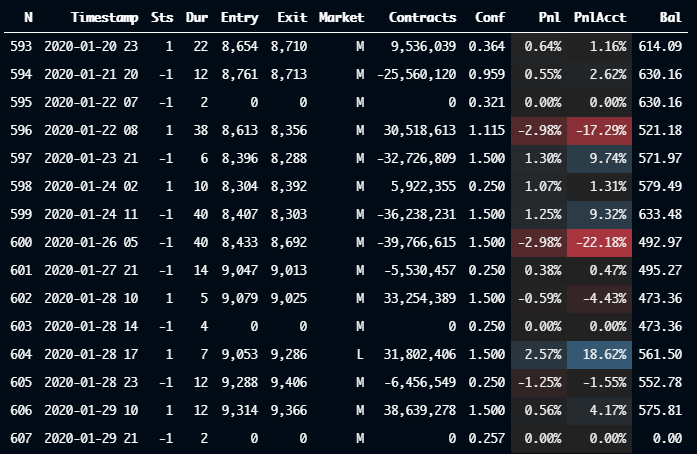
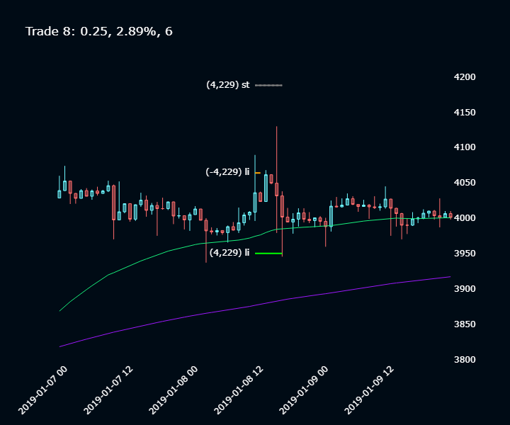

# jambot
*Code only as a portfolio example, not yet ready for public use.

In production, this app is hosted as an Azure Functions app running on a timer trigger, performing certain trade functions/checks/notifications on 5min and 1hr intervals.

>## Project
>**Functions** - Helper functions.
>
>**[JambotClasses](Project/JambotClasses.py)** - Main classes for backtesting strategies.
>
>**Launch** - Control module for local development, testing, backtesting strategies, multiprocess optimization etc. Used in VS Code with a Python Interactive (jupyter) environment.
>
>**[LiveTrading](Project/LiveTrading.py)** - Interaction with Bitmex for executing trades, and Google sheets for live dashboard of current status.
>TopLoop() is main control function, runs every 1 hour

>## Azure Functions App - Triggers
>**FiveMin** - Checks for filled orders and specific candle patterns, sends Discord alert messages.
>
>**OneHour** - Runs TopLoop() every hour.
>
>**HttpTrigger** - Respond to http requests from user dashboard to perform functions, place orders, reset strategy, refresh balance etc

## Example
``` py
from datetime import datetime as date

import Functions as f
import JambotClasses as c
import LiveTrading as live

symbol = 'XBTUSD'
daterange = 365
startdate = date(2019, 1, 1)
interval = 1

# Load OHLC data from Azure-hosted SQL server 
df = f.getDataFrame(symbol=symbol, startdate=startdate, daterange=daterange, interval=interval)

# Init TrendRev strategy
speed = (16, 6)
norm = (0.004, 0.024)
strat = c.Strat_TrendRev(speed=speed, norm=norm)
strat.slippage = 0
strat.stoppercent = -0.03
strat.timeout = 40

# Backtest strategy and plot balance
sym = c.Backtest(symbol=symbol, startdate=startdate, strats=[strat], df=df)
sym.decidefull()
sym.printfinal()
sym.account.plotbalance(logy=True)
```


```
strat.printtrades(last=15)
```


Use plotly to create interactive chart with order fill prices. Very useful to look through backtested trades and see how the strategy performed in each case.
```
t = strat.trades[8]
t.chart()
```
